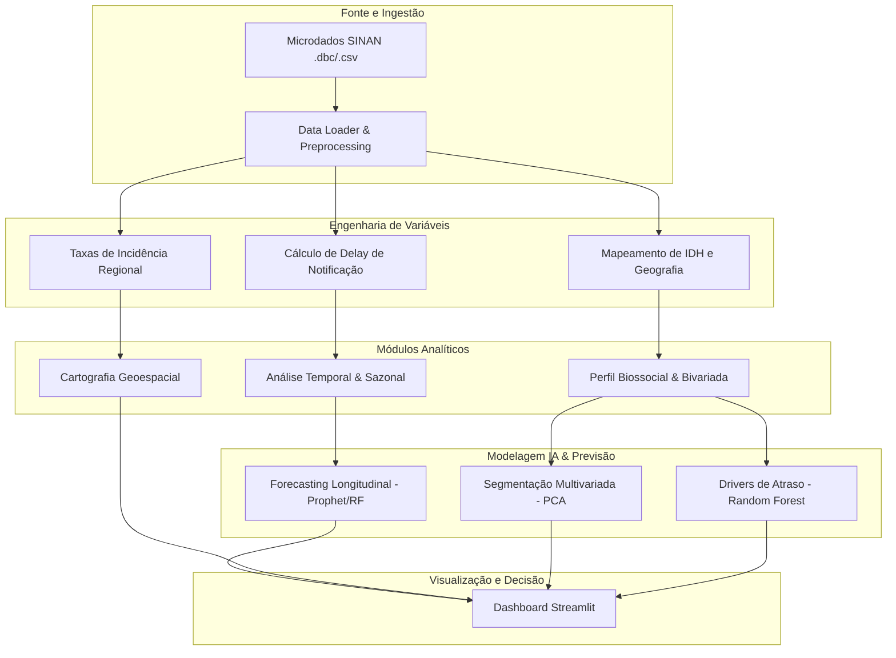

# Vigilância Epidemiológica: HIV Gestacional

Esta plataforma de inteligência especializada foi desenvolvida para monitorar e analisar a evolução epidemiológica do HIV em gestantes no Brasil, utilizando dados oficiais do Sistema de Informação de Agravos de Notificação (SINAN/MS). O projeto integra técnicas avançadas de ciência de dados, modelagem estatística e inteligência artificial para fornecer insights sobre perfis sociais, adesão ao pré-natal e projeções temporais de longo prazo.

---

## Títulos do Projeto

### Objetivo
O objetivo central deste ecossistema é apoiar a vigilância em saúde por meio da análise multidimensional de notificações compulsórias.
* **Problema Analisado**: Transmissão vertical de HIV e perfis de vulnerabilidade em gestantes.
* **Fonte dos Dados**: Microdados consolidados do SINAN/Ministério da Saúde (2018-2023).
* **Abordagem Analítica**: Séries temporais (Prophet/Holt-Winters), Análise Multivariada (PCA), Inferência Causal (Random Forest) e Cartografia Geoespacial.
* **Tecnologias Utilizadas**: Python, Streamlit, Pandas, Scikit-learn, Plotly, Statsmodels.

---

## Contexto

A vigilância epidemiológica do HIV em gestantes é um componente crítico das políticas de saúde pública no Brasil. A detecção precoce e o acompanhamento longitudinal são essenciais para reduzir as taxas de transmissão vertical para níveis abaixo de 2%, conforme diretrizes atuais da OMS e do Ministério da Saúde. Este projeto aborda a complexidade das notificações, lidando com lacunas de processamento (*data lag*), atrasos de notificação e disparidades regionais de incidência.

---

## Fonte de Dados

Os dados são provenientes do **SINAN (Sistema de Informação de Agravos de Notificação)**, gerido pelo Ministério da Saúde.
* **Período Analisado**: 01/2018 a 12/2023 (Dados de 2024 filtrados para evitar distorções por atraso de notificação).
* **Estrutura do Dataset**: O banco de dados consolidado contém notificações com variáveis de data (notificação, diagnóstico), localização (UF, Região), perfil demográfico (idade, raça, escolaridade) e dados clínicos (tipo de parto, adesão ao pré-natal, uso de antirretrovirais).
* **Pré-processamento**: Inclui limpeza de duplicatas fidedigna (chaves múltiplas), recodificação de dicionários DataSUS e tratamento de outliers de idade (10 a 55 anos).

---

## Arquitetura do Projeto

O fluxo de dados segue uma pipeline robusta desde o processamento bruto até a entrega de inteligência preditiva.



---

## Principais Dashboards e Funcionalidades

A plataforma está estruturada em módulos de visualização especializada:

1.  **Evolução Temporal**: Monitoramento da tendência de notificações com médias móveis (MA30) e análise de crescimento anual.
2.  **Perfil Social**: Exploração da concentração etária (KDE), declaração étnico-racial e grau de escolaridade.
3.  **Cartografia**: Mapas coropléticos de densidade absoluta e incidência relativa (casos por 100 mil habitantes).
4.  **Adesão a Pré-natal**: Funil de retenção longitudinal, analisando do diagnóstico ao uso de antirretrovirais no parto.
5.  **Inteligência Artificial**:
    *   **PCA (Bússola de Risco)**: Segmentação das regiões baseado em indicadores biossociais.
    *   **Previsão**: Projeções mensais de volume de notificações até Dezembro de 2027.
    *   **Drivers**: Identificação dos principais fatores que impactam o atraso na notificação oficial.

---

## Modelagem e Inteligência Artificial

A plataforma utiliza um *ensemble* de técnicas estatísticas para inferência:
*   **Segmentação (PCA)**: Redução de dimensionalidade para identificar agrupamentos regionais com base em taxas de incidência e idade.
*   **Inferência (Random Forest)**: Determinação da importância das *features* (feature importance) para explicar o *delay* de notificação e padrões de adesão.
*   **Forecasting (Prophet & Holt-Winters)**: Modelos aditivos que capturam sazonalidade anual e tendências de longo prazo para planejamento de estoque de insumos e alocação de recursos.

---

## Configuração e Execução

### Requisitos
Certifique-se de ter o Python 3.9+ instalado e as dependências listadas em `requirements.txt`.

```bash
pip install -r requirements.txt
```

### Inicialização
Para carregar a interface interativa:

```bash
streamlit run dashboard/app.py
```

---
> **Nota**: Projeto desenvolvido para fins de análise técnico-científica e apoio à decisão em saúde pública.
